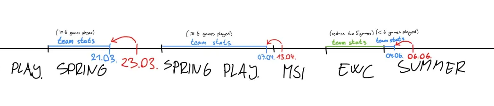

# lol-worlds-2025-predict

This project aims to predict the outcome of the League of Legends World Championship based on match data from the entire 2025 season, sourced from [gol.gg](https://gol.gg/). Team statistics, sourced from [oracleselixir.com](https://oracleselixir.com/), are updated daily and reflect performance only within the current tournament — from the team’s first match to their last match in that tournament. The prediction logic dynamically uses these team stats limited to each tournament’s timeframe.

## Team-Match Linking Logic:

The team–match linking logic is separated into three distinct cases:

- If a team plays six or more matches from its first match in the tournament to its last match in that tournament
  
  - Take the statistics for that period
 
- If it is the team's first match in the tournament

  - Take the statistics from previous tournament

- If a team plays less than six matches from its first match in the tournament to its last match in that tournament

  - Take the statistics from the previous tournament, reduced to five games
 
  - Combine the reduced statistics from the previous tournament with data from the period between the first and last games in the current tournament

## Used tournaments

- winter

        lpl - LPL 2025 Split 1 | LPL 2025 Split 1 Playoffs

        lec - LEC Winter 2025 | LEC 2025 Winter Playoffs

        lck - LCK Cup 2025

        lta - LTA North 2025 Split 1 | LTA South 2025 Split 1 | LTA 2025 Split 1 Playoffs

        lcp - LCP 2025 Season Kickoff | LCP 2025 Season Kickoff Qualifying Series

- spring

        lpl - LPL 2025 Split 2 Placements | LPL 2025 Split 2 | LPL 2025 Split 2 Playoffs
    
        lec - LEC 2025 Spring Season | LEC 2025 Spring Playoffs

        lck - LCK 2025 Rounds 1-2 | LCK 2025 Road to MSI

        lta - LTA North 2025 Split 2 | LTA North 2025 Split 2 Playoffs | LTA South 2025 Split 2 | LTA South 2025 Split 2 Playoffs

        lcp - LCP 2025 Mid Season | LCP 2025 Mid Season Qualifying Series

- summer

        lpl - LPL 2025 Split 3

        lec - LEC 2025 Summer Season

        lck - LCK 2025 Rounds 3-5

        lta - LTA North 2025 Split 3 | LTA South 2025 Split 3

        lcp - LCP 2025 Season Finals

- interleague

        2025 Mid-Season Invitational

        Esports World Cup 2025

## how to use it (Linux)

- Clone the repository

      git clone https://github.com/pavlila/lol-worlds-2025-predict.git
      cd lol-worlds-2025-predict
        
- Create and activate a virtual environment
  
      python3 -m venv venv
      source venv/bin/activate

- Install dependencies

      pip install -r requirements.txt
  
- Prepare the input data
  
  - Place your match data at `user/new_match.csv`
    
  - Make sure the file contains the following columns: tournament | teamA | teamB | date
 
- Process the new data

      cd user
      python3 process_new_data.py

- Run the prediction script

      cd user
      python3 prediction.py

  - The output below shows predictions for one match, where 1 indicates a win for Team A and 0 indicates a loss for Team A.
 
        Decision Tree: [0]
        Random Forest: [1]
        XGBoost: [1]
        Logistic regression: [1]

- Tip

  - To achieve the best accuracy, update the data after each round of the tournament

    - Add a row with match stats from [gol.gg](https://gol.gg/) to `data/raw/matches_tournament/split_name.csv`

    - Add a row with daily team stats (from the tournament start) from [oracleselixir.com](https://oracleselixir.com/) to `data/raw/teams_tournament/split_name.csv`
   
    - Make sure that all columns are correct
   
    - After completing the previous steps, process the data

          cd user
          python3 process_data.py

## Validation accuracy

The data used is from all tournaments listed in [Used tournaments](#used-tournaments), except for Worlds 2025 Play-In and Worlds 2025 Main Event. The percentages are based on match win rates, and the data is split into 60% training and 40% validation sets with a random seed of 42.

- Decision Tree: 68.42%
- Random Forest: 75.00%
- XGBoost: 73.68%
- Logistic Regression: 69.74%

## Testing accuracy

The data used is from Worlds 2025 Play-In and Worlds 2025 Main Event, the percentages are based on match win rates

- Decision Tree: x/y z%
- Random Forest: x/y z%
- XGBoost: x/y z%
- Logistic Regression: x/y z%
